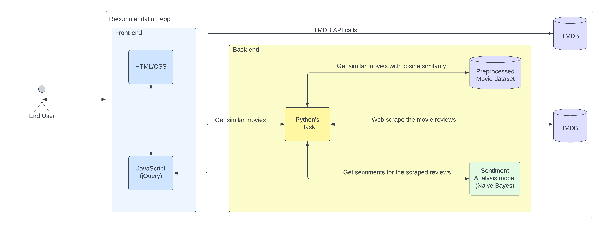

# SLIPSTREAM - The Movie Recommendation Engine

## Submission for MICROSOFT ENGAGE 2022 ✨


Content-Based Recommender System using AJAX which recommends movies similar to the likes of user and analyses the sentiments on the reviews given by the user for that movie.

<p align = "center">  </p>  
<!-- demo video link with badge -->

This web application provides all the details of the requested movie such as overview, genre, release date, rating, runtime, top cast, reviews, recommended movies, etc.

- The details of the movies(title, genre, runtime, rating, poster, etc) are fetched using an API by TMDB, https://www.themoviedb.org/documentation/api
- Using the IMDB ID of the movie in the API, Web scraping is done to get the reviews given by the user in the IMDB site using `beautifulsoup4` and sentiment analysis is performed on those reviews.

## Features and Interface
1. <b>Home page</b> 

- A pop-up shows up on opening the app telling about the auto suggestion feature used for searching the movies


- Seamless landing page with `Sign IN/Sign UP` page for login


2. <b> Feedback form </b>
- One of the most important part of Agile is feedback, therefore the app has a feedback form in the footer


3. <b> Sign IN/Sign UP page </b>
- Users can register themselves on the app and login into their accounts using the credentials


4. <b> Searching the movie </b>
- Enter the movie's name you want to get recommendations of 


- The app takes the input of movie and shows all the details of movie like ratings, genre, release date, runtime etc.


- Shows the top cast of the movie


- It also shows the reviews of the movie which are fetched from IMDb


5. <b>Recommendation</b> 

- The app then finally suggests movies similar to the likes of user 


## Architecture


## Similarity Score : 

How does it decide which item is most similar to the item user likes? Here come the similarity scores.
   
It is a numerical value ranges between zero to one which helps to determine how much two items are similar to each other on a scale of zero to one. This similarity score is obtained measuring the similarity between the text details of both of the items. So, similarity score is the measure of similarity between given text details of two items. This can be done by cosine-similarity.
   
## How Cosine Similarity works?
  Cosine similarity is a metric used to measure how similar the documents are irrespective of their size. Mathematically, it measures the cosine of the angle between two vectors projected in a multi-dimensional space. The cosine similarity is advantageous because even if the two similar documents are far apart by the Euclidean distance (due to the size of the document), chances are they may still be oriented closer together. The smaller the angle, higher the cosine similarity.
  


  
More about Cosine Similarity : [Understanding the Math behind Cosine Similarity](https://www.machinelearningplus.com/nlp/cosine-similarity/)

## Tools and Languages used
<p align="left"> <a href="https://getbootstrap.com" target="_blank" rel="noreferrer">  </a> <a href="https://www.w3schools.com/css/" target="_blank" rel="noreferrer">  </a> <a href="https://www.figma.com/" target="_blank" rel="noreferrer">  </a> <a href="https://firebase.google.com/" target="_blank" rel="noreferrer">  </a> <a href="https://flask.palletsprojects.com/" target="_blank" rel="noreferrer">  </a> <a href="https://git-scm.com/" target="_blank" rel="noreferrer">  </a> <a href="https://heroku.com" target="_blank" rel="noreferrer">  </a> <a href="https://www.w3.org/html/" target="_blank" rel="noreferrer">  </a> <a href="https://developer.mozilla.org/en-US/docs/Web/JavaScript" target="_blank" rel="noreferrer">  </a> <a href="https://nodejs.org" target="_blank" rel="noreferrer">  </a> <a href="https://pandas.pydata.org/" target="_blank" rel="noreferrer">  </a> <a href="https://www.python.org" target="_blank" rel="noreferrer">  </a> <a href="https://sass-lang.com" target="_blank" rel="noreferrer">  </a> <a href="https://scikit-learn.org/" target="_blank" rel="noreferrer">  </a> </p>

## How to get the API key?

Create an account in https://www.themoviedb.org/, click on the `API` link from the left hand sidebar in your account settings and fill all the details to apply for API key. If you are asked for the website URL, just give "NA" if you don't have one. You will see the API key in your `API` sidebar once your request is approved.

## How to run the project?

1. Clone this repository in your local system.
2. Install all the libraries mentioned in the [requirements.txt](https://github.com/kishan0725/The-Movie-Cinema/blob/master/requirements.txt) file with the command `pip install -r requirements.txt`.
3. Replace YOUR_API_KEY in **both** the places (line no. 23 and 43) of `static/recommend.js` file.
4. Open your terminal/command prompt from your project directory and run the `main.py` file by executing the command `python main.py`.
5. Go to your browser and type `http://127.0.0.1:5000/` in the address bar.
6. Hurray! That's it.

### Sources of the datasets 

1. [IMDB 5000 Movie Dataset](https://www.kaggle.com/carolzhangdc/imdb-5000-movie-dataset)
2. [The Movies Dataset](https://www.kaggle.com/rounakbanik/the-movies-dataset)
3. [List of movies in 2018](https://en.wikipedia.org/wiki/List_of_American_films_of_2018)
4. [List of movies in 2019](https://en.wikipedia.org/wiki/List_of_American_films_of_2019)
5. [List of movies in 2020](https://en.wikipedia.org/wiki/List_of_American_films_of_2020)

## Need help?

Feel free to contact me on [LinkedIn](https://www.linkedin.com/in/kataria-yash/) 

[](https://www.instagram.com/yashkatariaa_) [](https://twitter.com/yashh18_) 

---------

```javascript

if (youEnjoyed) {
    starThisRepository();
}

```

-----------

